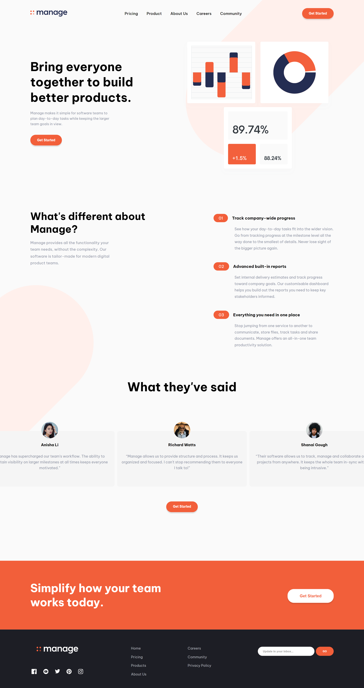

# Manage landing page

-> Project Link -- https://project33-managelandingpage.netlify.app/

# 🎊 Description

- First of all, I want to give my utmost gratitude to the team behind [Frontend Mentor](https://www.frontendmentor.com/) for providing amazing resources. All resources from this project came from them.With dozens of challenges at various levels, designed to test individuals in their skills. It caters to participants of any experience or proficiency level in their coding journey.

# 💡Comment

- This project is build using React. My first time learning and implementing React to my projects. It took some time to finish this but nonetheless I am proud with my progress.
-  This page is purely static with no functionalities and that is something I need to implement in the next project. I am now familiar with React - JSX, components, importing, exporting, virtual DOM, and more - the next step would be to dig deeper into hooks such as `useState`, `useEffect` and so on.

---
💥 See you in the next project! 

